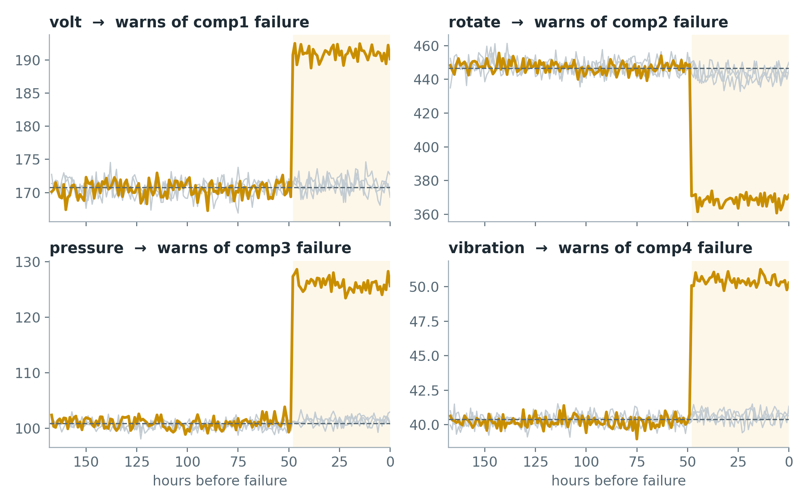

# Equipment Failure Early Warning: Predictive Maintenance

A machine-learning model that warns **24 hours before** a machine fails, built on one year of hourly sensor data from a 100-machine fleet.

**Live app:** _add your Streamlit link here_ · **Notebook:** [`notebooks/Pred_Maint.ipynb`](notebooks/Pred_Maint.ipynb)

| On four months of unseen data (Sep–Dec 2015) | |
|---|---|
| Failures caught | **220 / 220** |
| Warning before each failure | **24 hours** |
| False alarms | **~5 alarm-hours per week** across all 100 machines (≈0.03% of machine-hours) |
| PR-AUC | **0.998** (simple rules: 0.021 and 0.459) |

---

## Why this matters for mining

Mines run fleets of haul trucks, shovels, pumps and conveyors. When one stops unexpectedly, production stops with it. Most sites either repair after a breakdown or service on a fixed calendar, and failures still happen between scheduled visits.

Predictive maintenance uses sensor data to act **just before** a failure. A 24-hour warning is enough time to schedule a crew and get spare parts to the machine.

## Data

The [Microsoft Azure predictive maintenance sample](data/README.md): 100 machines, hourly readings for 2015, plus error, maintenance and failure logs.

| Table | Rows | Type |
|---|---|---|
| Telemetry (volt, rotate, pressure, vibration) | 876,100 | hourly grid |
| Errors | 3,919 | event log |
| Maintenance | 3,286 | event log |
| Failures | 761 | event log |
| Machines (model, age) | 100 | lookup |

> **The data is synthetic.** It is used here as a stand-in for real fleet telemetry. See [Limitations](#limitations).

## Key finding: each part has its own warning sign



Lining up all 761 failures on the failure hour and averaging shows that each component has one warning sensor: **comp1 → volt, comp2 → rotation, comp3 → pressure, comp4 → vibration**. The change appears about **48 hours** before failure, which made a 24-hour warning horizon realistic.

## Method

1. **Data checks:** every machine has exactly 8,761 hourly rows (no gaps). 743 of 761 failures match a maintenance record; the 18 that don't all fall at one timestamp on the first day of data.
2. **Label:** for every machine and hour, *will this machine fail in the next 24 hours?* Built with a forward `merge_asof` and checked by hand on a real failure. 1.96% of hours are positive.
3. **Features, using past data only, per machine:**
   - 3 h and 24 h rolling mean and standard deviation of each sensor
   - count of each error type in the last 24 h
   - hours since each component was last replaced (strictly before the current hour)
   - machine age and model (one-hot encoded)
4. **Time-based split:** train Jan–Aug, test Sep–Dec, with a 1-day gap equal to the label horizon. July–August is held out from training as a validation set.
5. **Model:** `HistGradientBoostingClassifier` with balanced class weights.
6. **Threshold:** 0.5, chosen on validation as the lowest setting with zero false alarms, then fixed before the test set was scored once.

## Results

### Baselines vs. model (test set)

| Method | PR-AUC |
|---|---|
| Random guessing | 0.018 |
| "Oldest part" rule (hours since replacement) | 0.021 |
| "Recent errors" rule (error count, last 24 h) | 0.459 |
| **Gradient boosting model** | **0.998** |

Accuracy is not used: a "model" that always predicts *no failure* is 98.2% accurate and catches nothing.

### Is 0.998 a leak? (validation set)

| Features used | PR-AUC |
|---|---|
| All features | 0.9997 |
| Error counts only | 0.67 |
| Sensor features only | 0.25 |
| Raw hourly sensors only | 0.07 |
| All features, predicting 24–48 h ahead | 0.83 |

A leak usually shows up as one feature group scoring near-perfectly on its own. None does: the model succeeds by **combining** error bursts with sensor shifts, and its score drops when asked to look further ahead, as expected from a real signal.

### What the model relies on

Permutation importance ranks the 24 h error counts first, followed by the 24 h means of the four warning sensors. Replacement timing, age and standard-deviation features contribute little. This matches the exploratory analysis.

## Streamlit app

The dashboard (`app/streamlit_app.py`) shows the test-period predictions:

- **Fleet risk:** the 10 riskiest machines at any hour, with what actually happened next
- **Machine explorer:** risk and sensor history for one machine, with failures marked
- **Threshold trade-off:** caught failures vs. false alarms as the alarm threshold changes
- **How it works:** method, baselines, leak test and feature importance

Run it locally:

```bash
pip install -r requirements.txt
streamlit run app/streamlit_app.py
```

## Limitations

- **Synthetic data.** Warning signs appear as sudden jumps about 48 h before failure; real components usually degrade gradually over days or weeks.
- **Clean labels.** Real failure records come from hand-typed work orders, often with late or approximate timestamps.
- **Many failures.** 761 failures is generous; a real fleet may have only dozens per failure type.
- **No operating context.** Payload, haul-road grade, shift and ambient conditions would all affect real readings.

## Next steps

- Predict which component will fail, and remaining useful life
- Use a longer warning horizon (24–48 h), where the warning-time vs. false-alarm trade-off becomes real
- Apply the same pipeline to real mine telemetry, adding resampling for gaps, label cleaning and longer trend features

## Repository structure

```
├── app/
│   ├── streamlit_app.py          # dashboard
│   └── data/                     # small files exported from the notebook
├── data/README.md                # where to download the raw data
├── images/warning_sensors.png
├── notebooks/
│   ├── Pred_Maint.ipynb          # full analysis
│   └── export_for_app.py         # final notebook cell that creates app/data
├── requirements.txt              # app
└── requirements-notebook.txt     # notebook
```

## Reproduce

1. Download the raw data into `data/` (see [`data/README.md`](data/README.md)).
2. Run `notebooks/Pred_Maint.ipynb` from top to bottom.
3. Run the cell in `notebooks/export_for_app.py` to regenerate `app/data/`.

## Author

**Brandon Kazangarare**, Mining Engineering, Central South University · [GitHub](https://github.com/BrandonKaza32)
